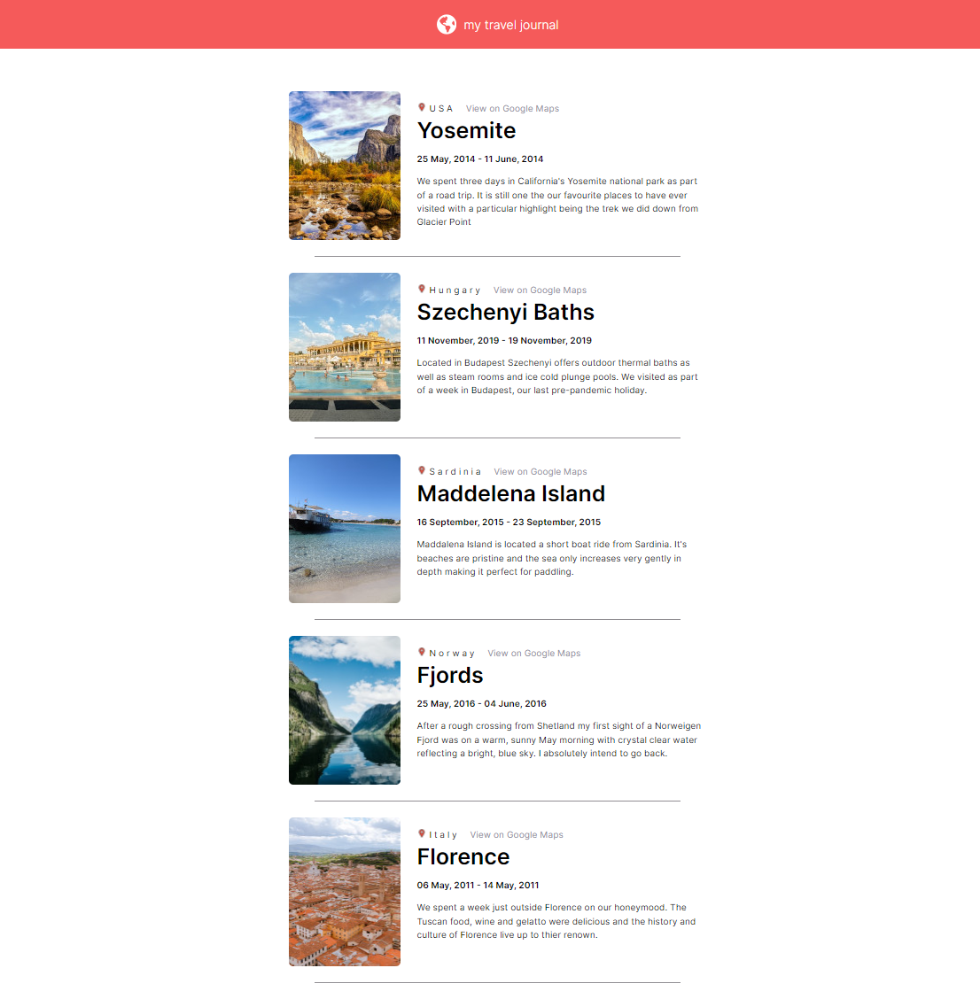

Travel journal site created as part of the FreeCodeCamp Introduction to React Course.

The content of the journal entries is generated dynamically from data.js using props. I had to place the journal images in the public folder to achieve this. Styling is simple CSS.

Some images have been taken from Unsplash.

[Link to Vercel Deployment](https://travel-blog-drx60red7-ricksoc.vercel.app/)

